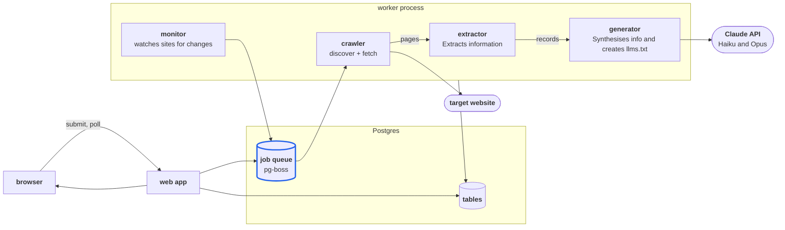
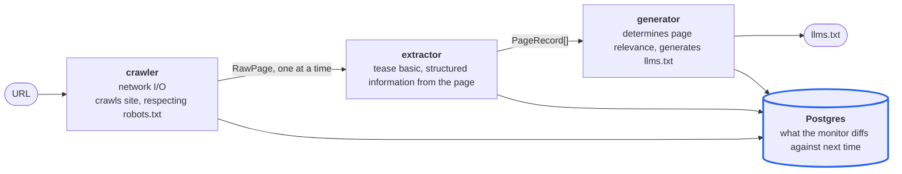
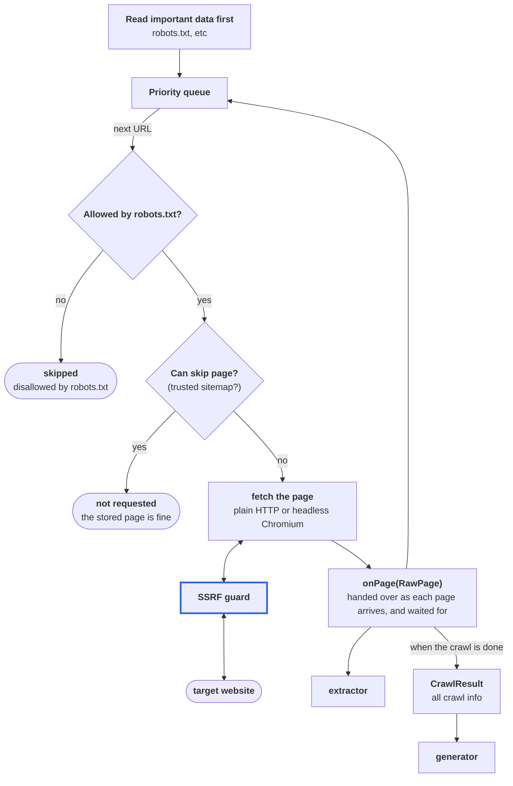
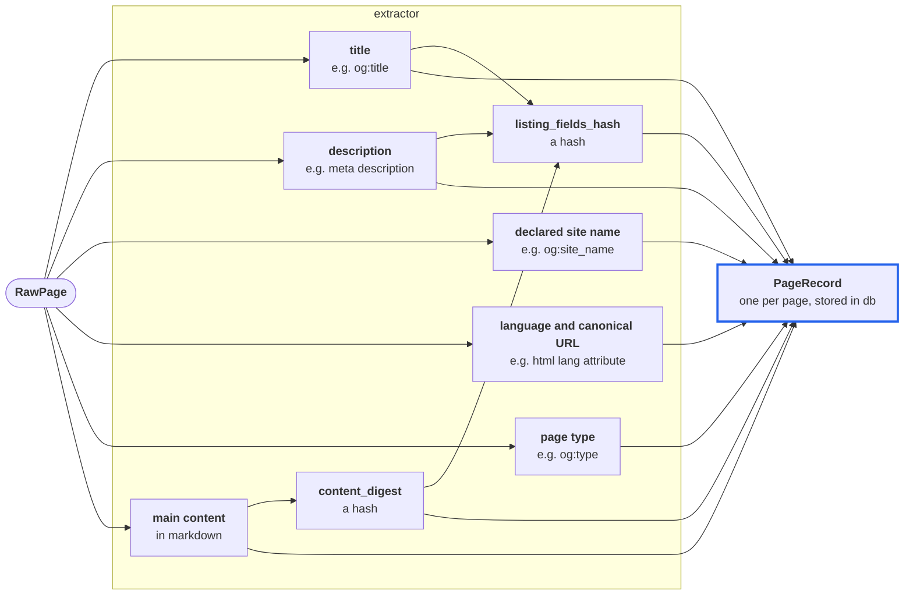
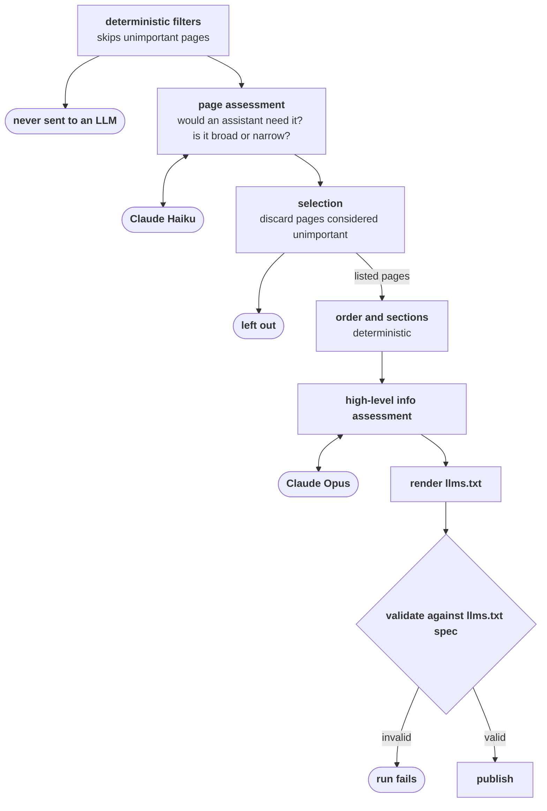
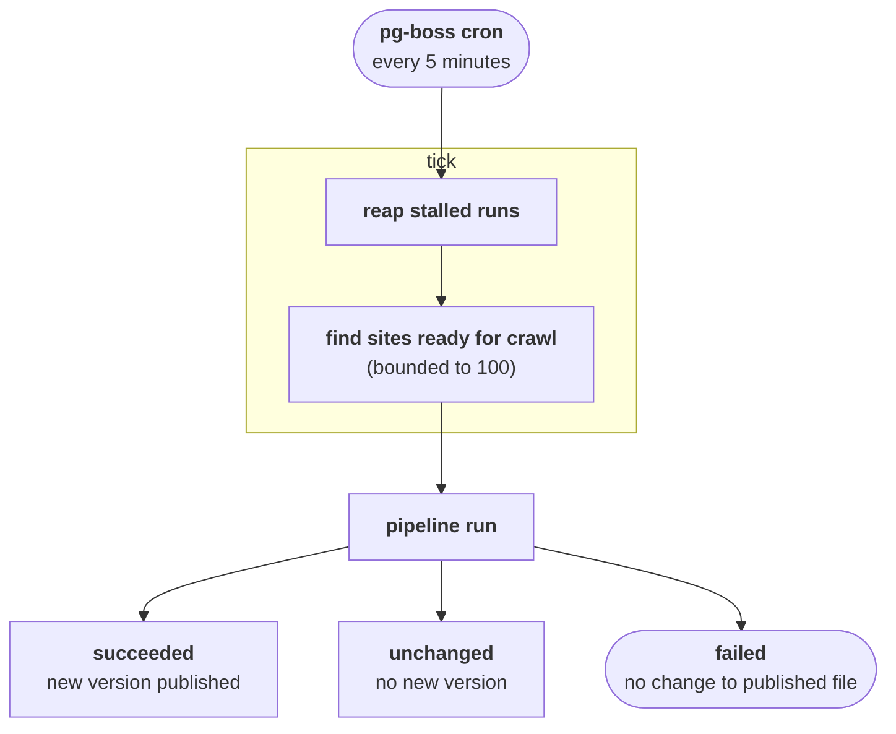
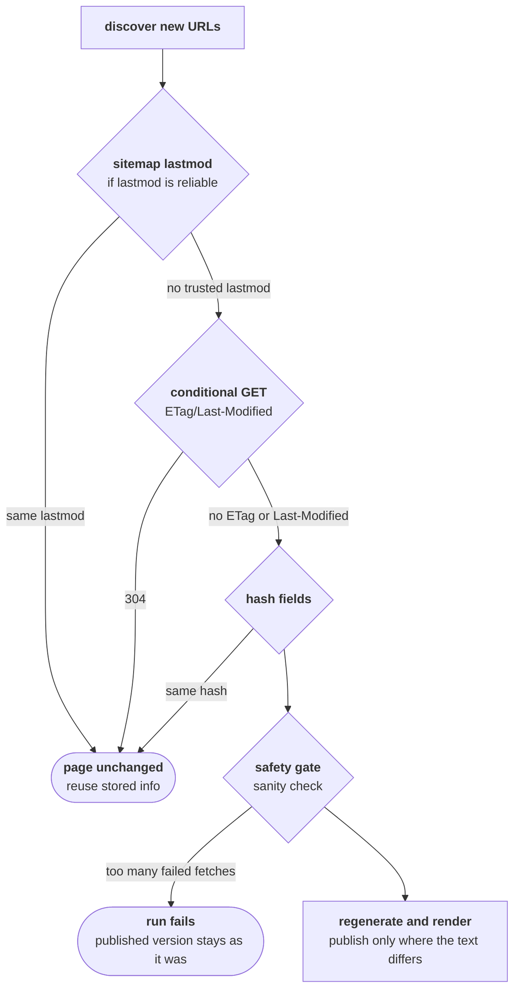

# System design

## System overview

```mermaid
flowchart LR
  browser["<b>browser</b>"]
  web["<b>web app</b>"]
  site(["<b>target website</b>"])
  claude(["<b>Claude API</b><br/>Haiku and Opus"])

  subgraph postgres["Postgres"]
    tables[("<b>tables</b>")]
    queue[("<b>job queue</b><br/>pg-boss")]
  end

  subgraph worker["worker process"]
    crawler["<b>crawler</b><br/>discover + fetch"]
    extractor["<b>extractor</b><br/>Extracts information"]
    generator["<b>generator</b><br/>Synthesises info and creates llms.txt"]
    monitor["<b>monitor</b><br/> watches sites for changes"]
    crawler -- "pages" --> extractor
    extractor -- "records" --> generator
  end

  browser -- "submit, poll" --> web
  web --> browser
  web  --> tables
  web --> queue
  queue  --> crawler
  monitor --> queue
  crawler --> site
  generator --> claude
  worker --> tables

  style queue stroke:#2563eb,stroke-width:3px
```

## Pipeline contracts

```mermaid
flowchart LR
  url(["URL"])
  crawler["<b>crawler</b><br/>network I/O<br/>crawls site, respecting robots.txt<br/>"]
  extractor["<b>extractor</b><br/>tease basic, structured information from the page"]
  generator["<b>generator</b><br/>determines page relevance, generates llms.txt"]
  file(["llms.txt"])
  postgres[("<b>Postgres</b><br/>what the monitor diffs against next time")]

  url --> crawler
  crawler -- "RawPage, one at a time" --> extractor
  extractor -- "PageRecord[]" --> generator
  generator --> file
  crawler --> postgres
  extractor --> postgres
  generator --> postgres

  style postgres stroke:#2563eb,stroke-width:3px
```

## Crawler

```mermaid
flowchart TD
  discover["<b>Read important data first</b><br/>robots.txt, etc"]
  frontier["<b>Priority queue</b>"]
  allowed{"<b>Allowed by robots.txt?</b>"}
  skipped(["<b>skipped</b><br/>disallowed by robots.txt"])
  needed{"<b>Can skip page?</b><br/>(trusted sitemap?)"}
  notRequested(["<b>not requested</b><br/>the stored page is fine"])
  fetch["<b>fetch the page</b><br/>plain HTTP or headless Chromium<br/>"]
  guard["<b>SSRF guard</b>"]
  site(["<b>target website</b>"])
  onPage["<b>onPage(RawPage)</b><br/>handed over as each page arrives, and waited for"]
  workerStore["<b>extractor</b>"]
  result["<b>CrawlResult</b><br/> all crawl info"]
  workerGate["<b>generator</b>"]

  discover --> frontier
  frontier -- "next URL" --> allowed
  allowed -- "no" --> skipped
  allowed -- "yes" --> needed
  needed -- "yes" --> notRequested
  needed -- "no" --> fetch
  fetch <--> guard
  guard <--> site
  fetch --> onPage
  onPage --> workerStore
  onPage  --> frontier
  onPage -- "when the crawl is done" --> result
  result --> workerGate

  style guard stroke:#2563eb,stroke-width:3px
```

## Extractor

```mermaid
flowchart LR
  raw(["<b>RawPage</b>"])

  subgraph pure["extractor"]
    title["<b>title</b><br/>e.g. og:title"]
    description["<b>description</b><br/>e.g. meta description"]
    siteName["<b>declared site name</b><br/>e.g. og:site_name"]
    language["<b>language and canonical URL</b><br/>e.g. html lang attribute"]
    pageType["<b>page type</b><br/>e.g. og:type"]
    content["<b>main content</b><br/>in markdown"]
    digest["<b>content_digest</b><br/>a hash"]
    listingHash["<b>listing_fields_hash</b><br/>a hash"]
  end

  record["<b>PageRecord</b><br/>one per page, stored in db"]

  raw --> title & description & siteName & language & pageType & content
  content --> digest
  title & description & digest --> listingHash
  title & description & siteName & language & pageType & content --> record
  digest & listingHash --> record

  style record stroke:#2563eb,stroke-width:3px
```

## Generator

```mermaid
flowchart TD
  filters["<b>deterministic filters</b><br/>skips unimportant pages"]
  notCandidate(["<b>never sent to an LLM</b>"])
  assessment["<b>page assessment</b><br/>would an assistant need it? is it broad or narrow?"]
  haiku(["<b>Claude Haiku</b>"])
  selection["<b>selection</b><br/>discard pages considered unimportant"]
  leftOut(["<b>left out</b>"])
  sections["<b>order and sections</b><br/>deterministic"]
  summary["<b>high-level info assessment</b><br/>"]
  opus(["<b>Claude Opus</b><br/>"])
  render["<b>render llms.txt</b>"]
  validate{"<b>validate against llms.txt spec</b>"}
  fails(["<b>run fails</b>"])
  publish["<b>publish</b>"]

  filters --> notCandidate
  filters --> assessment
  assessment <--> haiku
  assessment --> selection
  selection --> leftOut
  selection -- "listed pages" --> sections
  sections --> summary
  summary <--> opus
  summary --> render
  render --> validate
  validate -- "invalid" --> fails
  validate -- "valid" --> publish
```

## Monitor

### Scheduling

```mermaid
flowchart TD
  cron(["<b>pg-boss cron</b><br/>every 5 minutes"])

  subgraph tick
    reap["<b>reap stalled runs</b>"]
    claim["<b>find sites ready for crawl</b><br/>(bounded to 100)"]
    reap --> claim
  end

  run["<b>pipeline run</b>"]
  succeeded["<b>succeeded</b><br/>new version published"]
  unchanged["<b>unchanged</b><br/>no new version"]
  failed(["<b>failed</b><br/>no change to published file"])

  cron --> reap
  claim --> run
  run --> succeeded & unchanged & failed
```

### Change detection

```mermaid
flowchart TD
  discover["<b>discover new URLs</b>"]
  lastmod{"<b>sitemap lastmod</b><br/>if lastmod is reliable"}
  conditional{"<b>conditional GET</b><br/>ETag/Last-Modified"}
  hash{"<b>hash fields</b>"}
  same(["<b>page unchanged</b><br/>reuse stored info"])
  gate{"<b>safety gate</b><br/>sanity check"}
  fails(["<b>run fails</b><br/>published version stays as it was"])
  publish["<b>regenerate and render</b><br/>publish only where the text differs"]

  discover --> lastmod
  lastmod -- "same lastmod" --> same
  lastmod -- "no trusted lastmod" --> conditional
  conditional -- "304" --> same
  conditional -- "no ETag or Last-Modified" --> hash
  hash -- "same hash" --> same
  hash --> gate
  gate -- "too many failed fetches" --> fails
  gate --> publish
```

## Data model

```mermaid
erDiagram
  users ||--o{ sites : "owns"
  sites ||--o{ pages : "has many"
  sites ||--o{ pipeline_runs : "has many"
  sites ||--o{ llms_txt_versions : "has many"
  sites ||--o{ excluded_url_prefixes : "ignores"
  sites |o--o| llms_txt_versions : "published_version_id: the version this site serves"
  pipeline_runs ||--o{ pages : "seen in"
  pipeline_runs ||--o{ llms_txt_versions : "publishes"
  pages ||--o| page_overrides : "overrides a page"

  users {
    uuid id PK
    text username UK
    text password_hash
    timestamptz created_at
  }

  sites {
    uuid id PK
    uuid owner_user_id FK
    text root_url "unique per owner"
    text submitted_url "unique per owner"
    text public_slug UK
    text site_title
    text generated_site_name
    text generated_summary
    text[] generated_notes
    text generated_summary_source_hash
    interval monitor_check_interval
    timestamptz next_monitor_check_at
    timestamptz last_monitor_check_at
    boolean sitemap_lastmod_is_trusted
    boolean requires_headless_rendering
    timestamptz headless_rendering_decided_at
    text[] machine_readable_resource_urls
    uuid published_version_id FK
    boolean is_published_version_pinned
    timestamptz created_at
  }

  pages {
    uuid id PK
    uuid site_id FK
    text normalised_url "identity: unique per site"
    text fetch_url "writer: crawler"
    integer http_status_code "writer: crawler"
    text http_etag "writer: crawler"
    text http_last_modified "writer: crawler"
    timestamptz last_fetched_at "writer: crawler"
    text fetch_method "writer: crawler"
    integer crawl_depth "writer: crawler"
    text discovered_via "writer: crawler"
    boolean is_in_site_navigation "writer: crawler"
    integer inbound_link_count "writer: crawler"
    text navigation_label "writer: crawler"
    integer navigation_position "writer: crawler"
    text[] outbound_link_urls "writer: crawler"
    integer first_link_position "writer: crawler"
    timestamptz sitemap_last_modified_at "writer: crawler"
    text markdown_variant_url "writer: crawler"
    boolean has_noindex_directive "writer: crawler"
    text canonical_url "writer: extractor"
    text extracted_title "writer: extractor"
    text extracted_description "writer: extractor"
    text declared_site_name "writer: extractor"
    text page_type "writer: extractor"
    text language_code "writer: extractor"
    text content_markdown "writer: extractor"
    text content_digest "writer: extractor"
    text listing_fields_hash "writer: extractor"
    timestamptz last_extracted_at "writer: extractor"
    text generated_description "writer: generator"
    text assessed_page_type "writer: generator"
    text assessed_page_scope "writer: generator"
    text listing_value "writer: generator"
    text exclusion_reason "writer: generator"
    text assessment_source_hash "writer: generator"
    uuid first_seen_pipeline_run_id FK "lifecycle"
    uuid last_seen_pipeline_run_id FK "lifecycle"
    timestamptz removed_at "lifecycle"
  }

  page_overrides {
    uuid page_id PK, FK
    text description_override
    boolean is_excluded
    boolean is_kept
    timestamptz updated_at
  }

  excluded_url_prefixes {
    uuid site_id PK, FK
    text url_prefix PK
    timestamptz created_at
  }

  pipeline_runs {
    uuid id PK
    uuid site_id FK
    text triggered_by
    text status
    text current_stage
    uuid queue_job_id
    timestamptz last_heartbeat_at
    integer pages_discovered_count
    integer pages_fetched_count
    integer pages_changed_count
    integer pages_failed_count
    text error_message
    timestamptz created_at
    timestamptz started_at
    timestamptz finished_at
  }

  llms_txt_versions {
    uuid id PK
    uuid site_id FK
    uuid pipeline_run_id FK
    integer version_number "unique per site"
    text llms_txt_content
    text llms_txt_content_hash
    integer listed_page_count
    jsonb page_changes
    text created_by
    timestamptz created_at
  }
```

